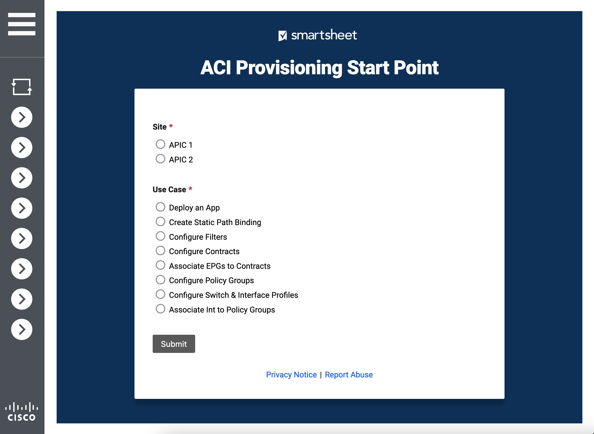
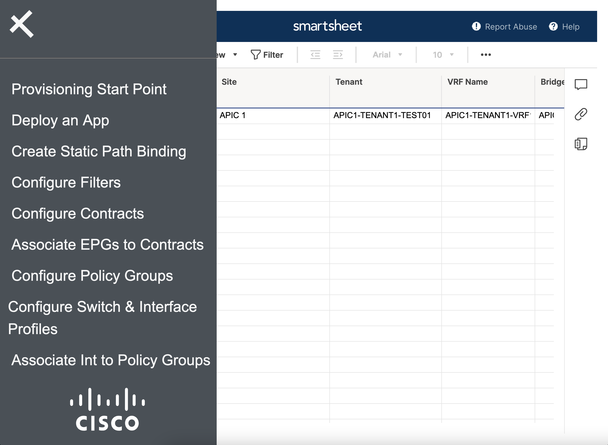
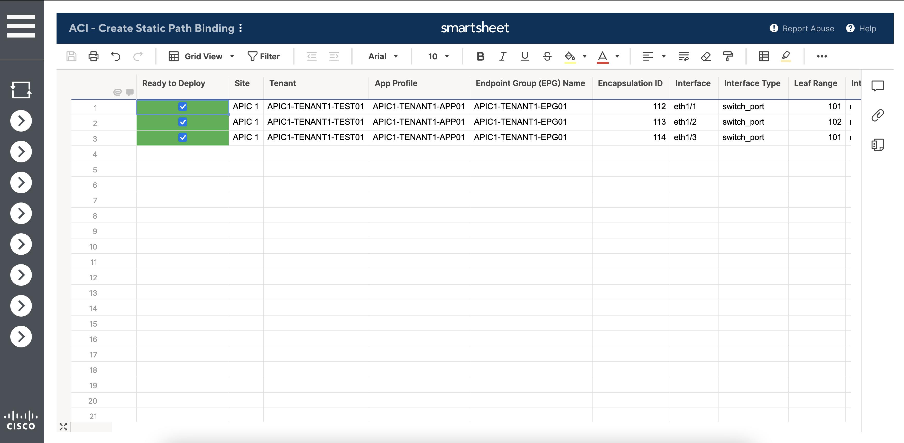

# ACI management simplification using Smartsheets

The ACI management simplification with Python use case offers ACI data center administrators a simple and intuitive interface for interacting and managing their data center infrastructure. Using smartsheets and forms from https://www.smartsheet.com as input and collection of data points, data center administrators can automate and simplify the configuration of ACI fabrics using the Python code in this repo. The ACI APIC GUI interface can be intimidating and confusing, especially for technicians and engineers that are just getting started with managing ACI. The main purpose of this use case is to simplify this interaction and to make it easier for ACI administrators to manage data center infrastructure. We have decided to cover eight common day to day ACI management activities in our use case:
  - Deploy an application
  - Create static path bindings
  - Configure filters
  - Configure contracts
  - Configure policy groups
  - Configure switch interface profiles
  - Associate interfaces to policy groups
  - Associate EPGs to contracts

Additional ACI management activities similar to the ones above can be easily created by extending the Python code in this repo.

* Technology stack: Python, Ansible, Cisco ACI, REST APIs, Smartsheet API, HTML/CSS, JavaScript

# Use case description

The use case in this repo was developed for two ACI APIC instances: APIC1 and APIC2, with the idea of a primary and secondary data center locations in mind but it can be extended for any number of APIC instances. The code for this use case is organized in several different folders based on code modularity and functionality. There are several components that come together to accomplish all the requirements of this use case:
  - get-tenants.py in the Cron folder is the component that periodically checks for any updates in regards to the tenants that are available within the ACI APICs and updates the drop down list of tenants in the "ACI Provisioning Start Point" smartsheet form. As the name of the folder suggests, this script should be run as a cron job at regular intervals. For dynamic environments in which tenants are created and destroyed on a daily basis, we suggest setting the cron job to run as often as needed to capture all the tenant changes in the fabric (i.e. as low as every 5 minutes). For more static ACI environments in which tenants are created and destroyed on a monthly or yearly basis, running this script in a cron job on a daily basis should suffice in most cases. The main idea is that the "ACI Provisioning Start Point" smartsheet form should not contain any stale information about the tenants created and destroyed in the ACI fabric. We leave the decision of how often to run this script to the ACI administrators implementing this code in their environment.
  - the Frontend components in the `frontend` folder contain the JavaScript and CSS code to build a hamburger menu and include all the forms and smartsheets that will be used in this use case. The collection of icons from https://github.com/CiscoDevNet/CiscoUIKit are also used and included in the folder.
  - the folders describing each of the eight ACI management activities implemented contain Ansible YML variable, inventory and playbook files. Ansible is used to perform the ACI changes for each of the eight activities and is being invoked through Python code. For each change that is being performed in the ACI fabric, a status is being returned to the user in the form of a color coded smartsheet cell in which a red cell background means the change has failed while a green color coded cell background means the change was successfully performed. The code has been tested with Ansible version 2.9.4.
  - the Backend components are contained in the main.py, config.ini, config.json files and the modules folder. The backend is a FLASK application that performs several functions:
      * Populates the picklists on all smartsheets based on the APIC, tenant and use case selections in the "ACI Provisioning Start Point" form.
      * Listens for Smartsheet API webhook notifications for any changes that were saved in forms and smartsheets.
      * Based on ACI configuration parameters received over the webhooks, it dynamically creates an Ansible YML variable file as well as an Ansible YML playbook file.
      * Runs dynamically generated Ansible playbooks and applies the ACI configuration changes to the fabric.
      * Based on the success or failure of running the Ansible playbook, update the smartsheet `ready to deploy` cell background color to either a green color for success or red for failure.

* Screenshots:

<kbd></kbd>
Figure 1 - ACI Provisioning Start Point

<kbd></kbd>
Figure 2 - Hamburger menu with all 8 use cases

<kbd></kbd>
Figure 3 - Configuring multiple static path bindings at the same time

# Installation

Two options are provided: self-directed installation with requirements OR Docker. Pick whichever suites your preference, security requirements and deployment capabilities. When running as a self-directed installation with requirements, it is suggested to run this project in its own Linux Virtual Machine. Development was done on CentOS Stream 8.3, but releases at or above the 7 train or other Linux variants should be fine. Additionally, Ansible and Python environments should be installed - CentOS may have provided one in your installation. Our guidance is to keep the system-supplied version and install the latest Python and use virtual environments (venv) to maintain separation of environments from the core operating system. Our development was done on Python v3.9.1, but anything above v3.7 should be sufficient.

## Local, Linux-specific Installations:

### Step 1: Linux environment

Build a standard Linux VM with these initial characteristics [increase later if more performance is needed] 1 vCPU, 4 GB vRAM, 20 GB vHD RedHat Enterprise Linux, CentOS and Ubuntu are fine. Development was done on CentOS Stream 8.

### Step 2: Python

Ensure you have at least a Python 3.7 or higher environment. Virtual Environment (venv) support is suggested.

### Step 3: Ansible

Install Ansible on the Linux VM. You can follow the instructions at this link https://docs.ansible.com/ansible/latest/installation_guide/intro_installation.html if you need assistance.

### Step 4: Smartsheet API and account

You will need to have a paid https://www.smartsheet.com account. Once you register for a Smartsheet account, generate an API key under your Account -> Personal Settings -> API Access section. You can explore the Smartsheet API at https://smartsheet-platform.github.io/api-docs/.

### Step 5: ngrok

For test purposes, ngrok can be used to receive webhooks from the Smartsheet API. More details about ngrok can be found at https://ngrok.com/.

# Configuration

The Python code is self contained and should not need any modifications for different APIC instances. The only files that have to be modified to reflect different ACI fabrics are the `config.ini` file that contains a list of easily identifiable variables (i.e. Smartsheet API key, hostname, username and password for APIC instances, Smartsheet sheet ids and column ids, etc.) and the `inventory.yml` file in each use case specific folder. The `inventory.yml` file should contain the hostame, username and password for the APICs.

## Get started for local development

* Install project dependencies.

```
pip install -r requirements.txt
```

* Update `config.ini` with your sheet IDs, callback URL, webhook name, [access token](http://smartsheet-platform.github.io/api-docs/#authentication-and-access-tokens), column IDs and column index similar to the snippet of configuration below:

```
[Environment]
smartsheet_API_key = asdflkjslsdf83450932845hfklashdfkashdf
APICs = APIC1,APIC2
sheet_ids = 11111111111111,222222222222222,33333333333333,44444444444444,55555555555555,66666666666666,77777777777777,8888888888888,9999999999999
call_back_url = https://test.ngrok.io
webhook_name = aci-smartsheet
status_sheet = 11111111111111

[APIC1]
hostname = https://apic1
username = admin
password = password
tenant_column_id = 11111111111111

[APIC2]
hostname = https://apic2
username = admin
password = password
tenant_column_id = 222222222222222
```

* Start Flask, If you change any code or config information you will need to restart Flask.

```
export FLASK_APP=main.py
python -m flask run --host=localhost --port=3000
```
* Configure JSON format for Ansible output when running ansible-playbook

```
export ANSIBLE_STDOUT_CALLBACK=json
```

## Getting a local callback url

The callback url must be publically accessible and use https from the smartsheet API to run correctly. Development environment can be setup with the tool [ngrok](https://ngrok.com/) as mentioned above.

After installing ngrok, start it with the command `./ngrok http 3000`. In the resulting screen copy to the https forwarding url and update the `config.ini` file with this value.

Leave ngrok running. If you restart ngrok, you will get a different callback url and will then need to update `config.ini` with your new url and restart Flask.

## Documentation

Smartsheet API - https://smartsheet-platform.github.io/api-docs/?python#overview

Flask - https://flask.palletsprojects.com/en/1.1.x/

# DevNet Sandbox

[Cisco ACI reservable sandbox](https://devnetsandbox.cisco.com/RM/Diagram/Index/661da090-c16c-4b8c-95db-1194e461964c?diagramType=Topology)

[Always-on ACI simulator](https://devnetsandbox.cisco.com/RM/Diagram/Index/5a229a7c-95d5-4cfd-a651-5ee9bc1b30e2?diagramType=Topology)

# Known issues

None known at this time.

# Getting help
For additional help, look to the [DevNet Developer Support](https://developer.cisco.com/site/support/) team. If major enhancements are requested, the [Cisco Customer Experience (CX) team](https://www.cisco.com/c/m/en_us/customer-experience/index.html) can be engaged for transactional assistance.

If you have questions, concerns, bug reports, etc., please create an issue against this repository.

# Getting involved
How to contribute is found in the CONTRIBUTING file.


# Licensing info

This Cisco DevNet Automation Exchange Premium project is provided under the 'Cisco Sample Code License, Version 1.1'. The terms can be viewed at [https://developer.cisco.com/site/license/cisco-sample-code-license/](https://developer.cisco.com/site/license/cisco-sample-code-license/)
